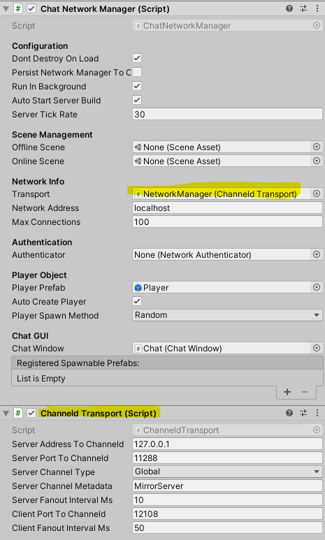

# Mirror integration of channeld
## Usage
1. Check out [channeld](https://github.com/indiest/channeld). To run channeld, either navigate to `cmd` folder and execute `go run .`, or [use Docker](https://github.com/indiest/channeld#2-docker).
2. Replace the Transport you are using in your Mirror project (KcpTransport by default) with [ChanneldTransport](Assets/channeld/ChanneldTransport.cs):

3. Run the project in server-only mode.
4. To test the client, you can create a new Unity project that has [symlink to the *Assets* folder](https://support.unity.com/hc/en-us/articles/115003118426-Running-multiple-instances-of-Unity-referencing-the-same-project) of your Mirror project. Run the project in client-only mode. 
